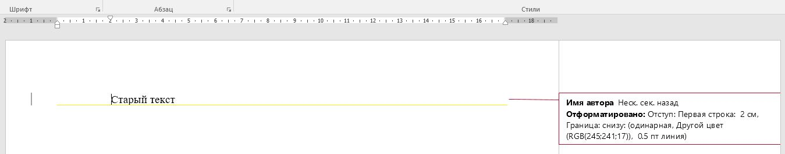
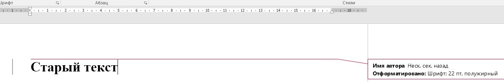
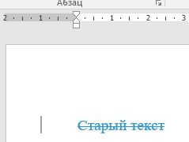
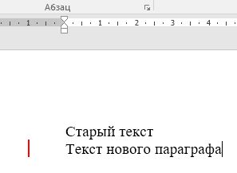
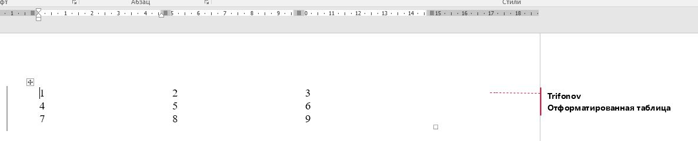
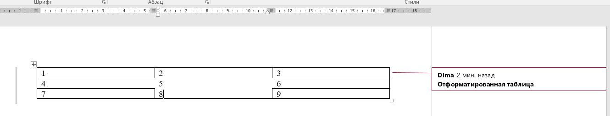

# TDV.Docx библиотека для рецензирования .docx документов


### Основные возможности: 
- Проверка и исправление стиля оформления текста(шрифт, размер, жирный, курсив, зачеркнутый, отступ, межстрочный интервал, цвет, заливка, рамка, подчеркивание)
- Проверка и исправление грифа документа и верхнем колонтитуле
- Проверка и исправление формата сносок документа
- Проверка и исправление стиля таблиц (границы, размер ячеек, отступы)


#### Немного о структуре .docx
.docx файл это переименованный .zip архив, имеющий следующую структуру:  
```
_rels  
customXml  
docProps  
word  
|- _resl  
|  |- document.xml.rels - связи (ссылка - файл)  
|- document.xml - Тело документа  
|- footer1.xml - нижний колонтитул   
|- footnotes.xml - Сноски  
|- header1.xml - верхний колонтитул  
|- styles.xml - стили документа  
[Content_Types].xml  
```
(перечислены не все файлы)  

все файлы хранятся в xml

Тело документа document.xml:
``` xml
<w:document ... >
	<w:body><!-- в body последовательно, будут перечислены абзацы и таблицы -->
		<!-- абзац. может содержать несколько Run'ов. У каждого Run может быть свой стиль оформления -->
		<w:p w:rsidR="00B93B17" w:rsidRPr="009D49F6" w:rsidRDefault="00162675" w:rsidP="00C83C69">
			<w:pPr> <!-- свойства абзаца -->
				<w:rPr> <!-- свойства Run (w:r) -->
					<w:lang w:val="en-US"/>
				</w:rPr>
			</w:pPr>
			<w:r w:rsidRPr="00C83C69"> <!--Run. может содержать текст, картинки и тп -->
				<w:rPr><!-- свойства Run. Здесь хранится инфо о формате текста. Шрифт, размре, цвет, ссылка на стиль и тп -->
					<w:rStyle w:val="ad"/>
					<w:rFonts w:eastAsiaTheme="majorEastAsia"/>
					<w:i w:val="0"/>
				</w:rPr>
				<w:t>1</w:t> <!-- текст Run'а-->
			</w:r>
			<w:r>
				...
			</w:r>
			
		</w:p>
		<w:sectPr w:rsidR="00B93B17" w:rsidRPr="009D49F6" w:rsidSect="00E142D1">
			<w:headerReference w:type="even" r:id="rId8"/>  <!-ссылка на файл заголовка по ID можно вычислить путь к файлу в _rels\document.xml.rels --> 
			
			<!--и другие ссылки -->
			<w:pgSz w:w="11906" w:h="16838"/>
			<w:pgMar w:top="1134" w:right="1134" w:bottom="1134" w:left="1134" w:header="709" w:footer="709" w:gutter="0"/>
			<w:cols w:space="708"/>
			<w:docGrid w:linePitch="360"/>
		</w:sectPr>
	</w:body>
</w:document>
```
Описана малая часть. Для общего понимания структуры документа

#### Подключение
```csharp
using TDV.Docx;
```

#### Открытие и сохранение документа
```csharp
using (FileStream fs = new FileStream("1.docx", FileMode.Open))
{
    DocxDocument doc = new DocxDocument(fs);

	/* change code */

	doc.document.Apply(); // Метод Apply() применяет изменения к файлу (в данном случае к document.xml)
	//Если вы изменяете другие файлы, например верхний колонтитул, для них так же нужно вызывать метод Apply()
	//cохранинение файла
	using (FileStream sw = new FileStream("1_fixed.docx", FileMode.OpenOrCreate))
	{
		byte[] b = doc.ToBytes();
		sw.Write(doc.ToBytes(), 0, b.Length);
	}
}
```
далее предполагается, что doc - экземпляр DocxDocument

#### Навигация по документу
Тело документа содержит в себе последовательно параграфов и таблиц.  
Все эти классы унаследованы от базового <b>Node</b>
```csharp
foreach(Node node in doc.document.body.childNodes)
{
    if (node is Table) 
    {
        Table tbl = (Table)node;
        Tc cell = tbl.GetCell(0, 0);
        foreach (Paragraph p in cell.Paragraphs)
        {
            if (p.Text == "")
                p.CorrectDel("Дядя Вася"); //Удаление в режиме правки
        }
    }
    if (node is Paragraph)
    {
        Paragraph p = (Paragraph)node;
        p.Text = "это параграф";
    }
}
```


#### Стиль параграфа
Каждый параграф содержит параметры стиля. Если параграф содержит ссылку на стиль сначала применяются параметры стиля, затем параметры параграфа.  
Например, если в стилек указано выравнивание по центру, а свойствах параграфа справа в итоге будет выравнивание по правому краю.  
Аналогично устроены все параметры.

Свойства параграфа содержат в себе свойства Run (w:rPr). каждый Run так же содержит раздел свойств. Свойства Run более приоритетны чем свойства родительского параграфа.

Получить/установить парамтры параграфа:
```csharp
Paragraph p = (Paragraph)node;
p.pPr.HorizontalAlign = HORIZONTAL_ALIGN.BOTH;
p.pPr.ind.firstLine = 1.25f;                                //отступ первой строки
p.pPr.pBdr.Bottom = new Border(LINE_TYPE.SINGLE, 4);    //Нижняя граница линия, толщина 4
p.pPr.pBdr.Between = new Border();                          //Граница между параграфами - нет
p.pPr.rPr.IsBold=false;                                     // Обращение к дефолтным свойствам Run
p.pPr.spacing.after = 0;                                    // отсутп после абзаца
p.pPr.spacing.before = 0;                                   // отсутп перед абзацем
p.pPr.spacing.line = 1;                                     // Межстрочный интервал                        
```

Класс PStyle содержит в себе все свойства параграфа.  
<b>Когда я пишу "все" - я подразумеваю все, которые я встретил:) ни разу не претендую на полный охват всех параметров формата</b>

```csharp
PStyle pStyle = new PStyle(HORIZONTAL_ALIGN.LEFT, new Border(), new Border(), new Border(),
    new Border(), new Border(), new Border(), 0, 0, 0, 0, 0, 0, 0);
p.pPr.SetStyle(pStyle); //Применить стиль pStyle к параграфу p    
```


#### Стиль Run
```csharp
Paragraph p = (Paragraph)node;
foreach (R r in p.rNodes)
{
    RProp runProp = r.rPr;
    runProp.border.border = new Border();   //Нет границы Run
    runProp.Color = "#ffffff";              //Белый цвет
    runProp.Highlight = "#000000";          //черная заливка
    runProp.IsBold = false;                 //не жирный
    runProp.IsItalic = true;                //курсив
    runProp.IsStrike = false;               //не зачеркнутый
    runProp.Underline = LINE_TYPE.DOTTED;   //подчеркнутый. линия из точек
    runProp.Font = "Times New Roman";       //шрифт
    runProp.FontSize = 10.5f;               //размер шрифта
}
```

Класс RStyle содержит в себе все свойства Run.  

```csharp
RStyle rStyle = new RStyle(true, "Times New Roman", 22, false, false, LINE_TYPE.NONE, "", "",new Border());
Paragraph p = (Paragraph)node;
foreach (R r in p.rNodes)
    r.rPr.SetStyle(rStyle);  
```

## Сравнение в режиме правки (рецензирование)
### Текст параграфа
```csharp
Paragraph p = (Paragraph)node;
p.CorrectSetText("новый текст", rStyle, "Имя автора");
```
Исходный документ:  
   
Исправленный:  

### Стиль параграфа
```csharp
PStyle pStyle = new PStyle(HORIZONTAL_ALIGN.LEFT, new Border(), new Border(), new Border(),
                    new Border(LINE_TYPE.SINGLE,4,0,"#f5f111"), new Border(), new Border(), 0, 0, 1, 2, 0, 0, 0);
Paragraph p = (Paragraph)node;
p.ComparePStyle(pStyle, "Имя автора");
```
Исходный документ:  
   
Исправленный:  

### Стиль Run
```csharp
RStyle rStyle = new RStyle(true, "Times New Roman", 22, false, false, LINE_TYPE.NONE, "", "",new Border());
Paragraph p = (Paragraph)node;
p.CompareRStyle(rStyle, "Имя автора");
```
Исходный документ:  
   
Исправленный:  


К параграфу можно сразу применить PStyle и RStyle:
```csharp
p.CompareStyles(pStyle, rStyle, "Имя автора");
```
### Удаление в режиме правки
```csharp
p.CorrectDel("Дядя Вася");
```
Исходный документ:  
   
Исправленный:  

### Вставка нового параграфа
```csharp
Paragraph p = (Paragraph)node;
Paragraph newP = doc.document.body.NewNodeAfter<Paragraph>(p.xmlEl);
newP.Text = "Текст нового параграфа";
newP.pPr.rPr.SetCorrectionMode("ins", "Дядя Дима");
```
Исходный документ:  
   
Исправленный:  

### Стиль таблицы
```chsarp
if (node is Table)
{
    Table tbl = (Table)node;
    TableStyle tableStyle = new TableStyle(new Border(), new Border(), new Border(), new Border(),
        new Border(), new Border(),
        true, 8500, TABLE_WIDTH_TYPE.PTC, 0, TABLE_WIDTH_TYPE.DXA);
    tbl.CompateStyle(tableStyle, "Trifonov");
}
```
Исходный документ:  
   
Исправленный:  


можно применять стили к конкретным ячейкам
```chsarp
Table tbl = (Table)node;
Tc cell = tbl.GetCell(1, 1); //вторая строка, второй столбец
CellStyle cellStyle = new CellStyle(VERTICAL_ALIGN.CENTER, new Border(), new Border(),
    new Border(), new Border(), 3000, TABLE_WIDTH_TYPE.DXA);
cell.CompareStyle(cellStyle, "Dima");
```
Исходный документ:  
   
Исправленный:  


В каждой ячейки таблицы содержится один или несколько параграфов. Работа с параграфами описана выше
### Верхний колонтитул
Верхний колонтитул содержится в одном из файлов header*.xml  
Document.xml содержит ссылку на файл колонтитула.   
Заговки бывают 3 видов    
DEFAULT - по умолчанию  
EVEN - каждый четный лист  
FIRST - Для первого листа  

Получение конкретного header:
```csharp
Header headerFirst = docxDocument.document.body.sectProp.GetHeader(REFERENCE_TYPE.FIRST);
Header headerDefault = docxDocument.document.body.sectProp.GetHeader(REFERENCE_TYPE.DEFAULT);
foreach (Node n in headerDefault.childNodes)
{
    if (n is Paragraph)
    {
        Paragraph p = (Paragraph)n;
        p.CompareStyles(pStyle, rStyleInnerUse, Author);
    }
}
h.Apply();

```
### Формат сносок
FOOTNOTE_NUM_FMT(enum):  
<b>DEFAULT</b> -  1, 2, 3  
<b>UPPER_LETTER</b> - A, B, C  
<b>LOWER_ROMAN</b> -  i, ii, iii  
<b>UPPER_ROMAN</b> - I, II, III  
<b>CHICAGO</b> - спецсимволы  

Изменить формат сноски:
```csharp
doc.document.body.sectProp.footnotePr.numFmt.Value = FOOTNOTE_NUM_FMT.LOWER_ROMAN;
```

изменить в режиме правки:
```csharp
doc.document.body.sectProp.CompareFooter(FOOTNOTE_NUM_FMT.DEFAULT);
```


